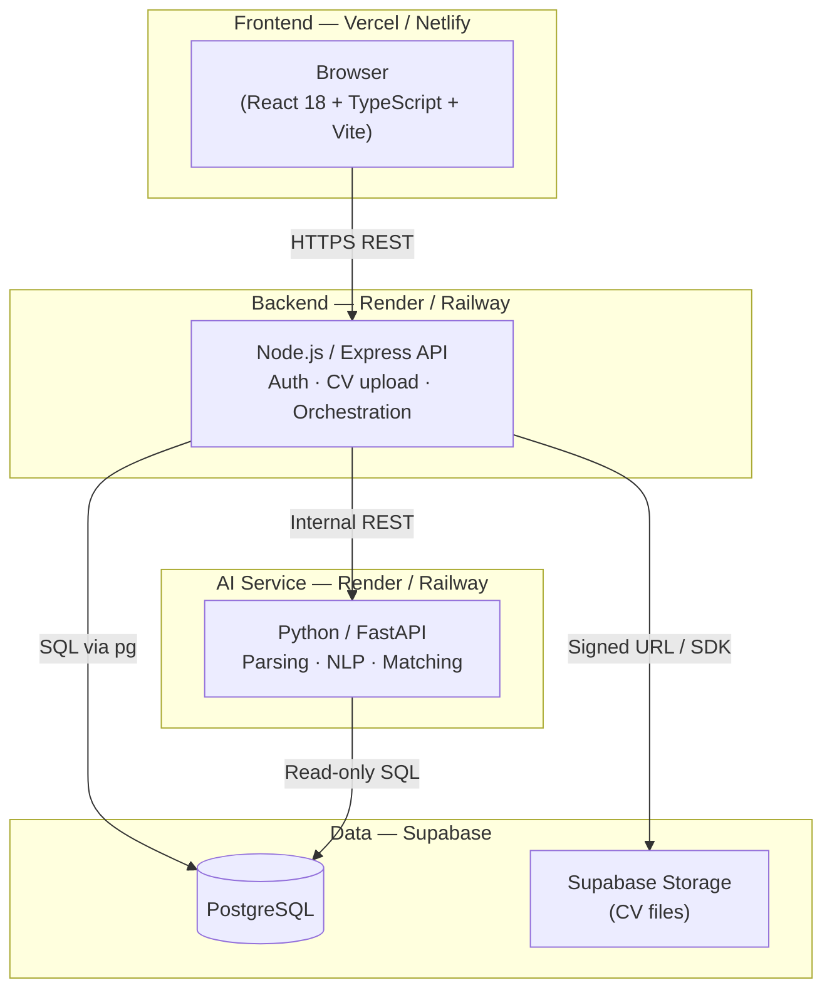
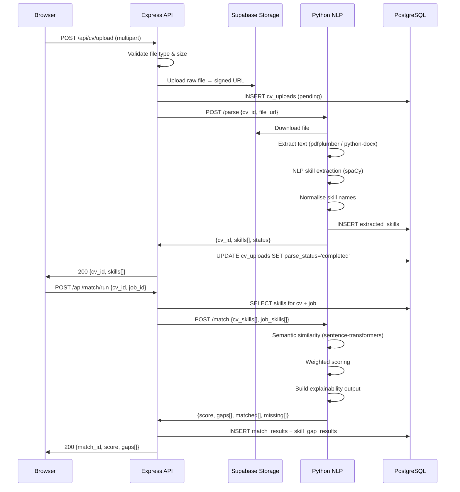
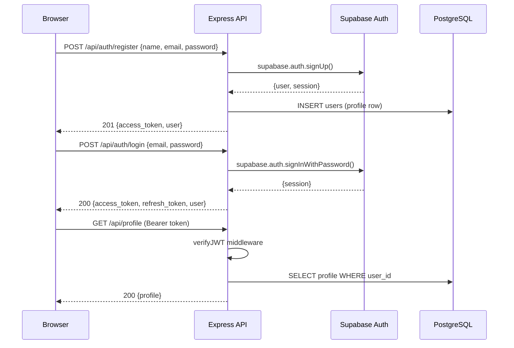

# Design Document: SkillLens Full-Stack Production Implementation

## Overview

SkillLens is a CV analysis and job-matching web application that extracts skills from uploaded CVs, compares them against job descriptions, and produces an explainable match score with skill-gap recommendations. The current codebase is a fully functional React/TypeScript frontend prototype using mock data and localStorage; this design covers the complete production stack that replaces every mock with real services: a Node.js/Express backend API, a Python AI/NLP microservice, and a PostgreSQL database hosted on Supabase.

The system adopts a modular multi-service architecture. The React frontend communicates exclusively with the Node.js backend over HTTPS/REST. The backend orchestrates authentication, file storage, database persistence, and delegates all document parsing and AI matching to the Python service. This separation keeps AI-heavy processing in Python (where the best NLP libraries live) while keeping web concerns in Node.js, and it maps cleanly onto the existing frontend page structure without requiring any route changes.


## Architecture

### High-Level System Diagram



### Request Flow — CV Upload to Match Result



### Authentication Flow




## Components and Interfaces

### Component 1: React Frontend (existing, to be wired up)

**Purpose**: All user-facing pages. Replaces mock Context API calls with real HTTP calls to the Express API.

**Key changes from prototype**:
- `AuthContext` — swap localStorage mock for real JWT-based API calls
- `DataContext` — swap localStorage mock for API calls; remove in-browser matching logic
- Add an `api.ts` service layer (Axios or fetch wrapper) with auth header injection
- Add loading/error states throughout (currently missing in mock flows)

**Interface** (TypeScript API client):
```typescript
interface ApiClient {
  auth: {
    register(name: string, email: string, password: string): Promise<AuthResponse>
    login(email: string, password: string): Promise<AuthResponse>
    logout(): Promise<void>
    refreshToken(): Promise<AuthResponse>
  }
  profile: {
    get(): Promise<Profile>
    update(data: Partial<Profile>): Promise<Profile>
  }
  cv: {
    upload(file: File, onProgress?: (pct: number) => void): Promise<CVUpload>
    get(cvId: string): Promise<CVUpload>
    list(): Promise<CVUpload[]>
    delete(cvId: string): Promise<void>
    reviewSkills(cvId: string, updates: SkillReview[]): Promise<CVUpload>
  }
  jobs: {
    create(data: CreateJobInput): Promise<JobDescription>
    get(jobId: string): Promise<JobDescription>
    list(): Promise<JobDescription[]>
    delete(jobId: string): Promise<void>
  }
  match: {
    run(cvId: string, jobId: string): Promise<MatchResult>
    get(matchId: string): Promise<MatchResult>
    history(): Promise<MatchResult[]>
  }
  feedback: {
    submit(matchId: string, rating: number, comments: string): Promise<void>
  }
}
```

---

### Component 2: Node.js / Express Backend API

**Purpose**: Single entry point for the frontend. Handles auth, validation, file orchestration, DB persistence, and delegates AI work to the Python service.

**Responsibilities**:
- JWT verification middleware on all protected routes
- Multipart file upload handling (Multer → Supabase Storage)
- Input validation (Zod schemas)
- Supabase Auth integration
- Internal HTTP calls to Python service
- PostgreSQL queries via `pg` or Prisma ORM

**Interface** (Express router structure):
```typescript
// src/routes/auth.ts
router.post('/register', validateBody(RegisterSchema), authController.register)
router.post('/login',    validateBody(LoginSchema),    authController.login)
router.post('/logout',   requireAuth,                  authController.logout)

// src/routes/profile.ts
router.get('/',  requireAuth, profileController.get)
router.put('/',  requireAuth, validateBody(ProfileSchema), profileController.update)

// src/routes/cv.ts
router.post('/upload', requireAuth, upload.single('file'), cvController.upload)
router.get('/:id',     requireAuth, cvController.get)
router.get('/',        requireAuth, cvController.list)
router.delete('/:id',  requireAuth, cvController.delete)
router.put('/:id/skills/review', requireAuth, cvController.reviewSkills)

// src/routes/jobs.ts
router.post('/',    requireAuth, validateBody(JobSchema), jobController.create)
router.get('/:id',  requireAuth, jobController.get)
router.get('/',     requireAuth, jobController.list)
router.delete('/:id', requireAuth, jobController.delete)

// src/routes/match.ts
router.post('/run',     requireAuth, matchController.run)
router.get('/:id',      requireAuth, matchController.get)
router.get('/history',  requireAuth, matchController.history)

// src/routes/feedback.ts
router.post('/', requireAuth, validateBody(FeedbackSchema), feedbackController.submit)
```

---

### Component 3: Python / FastAPI AI Service

**Purpose**: All document parsing and AI/NLP processing. Exposes a minimal internal REST API consumed only by the Express backend.

**Responsibilities**:
- PDF text extraction (pdfplumber primary, PyPDF2 fallback)
- DOCX text extraction (python-docx)
- Section segmentation (education, experience, skills)
- Skill entity extraction (spaCy NER + custom skill patterns)
- Skill normalisation (fuzzy matching against skill taxonomy)
- Semantic similarity scoring (sentence-transformers)
- Weighted match scoring and explainability output

**Interface** (FastAPI routes):
```python
# POST /parse
class ParseRequest(BaseModel):
    cv_id: str
    file_url: str          # Supabase signed URL
    file_type: Literal["pdf", "docx"]

class ParseResponse(BaseModel):
    cv_id: str
    skills: list[ExtractedSkill]
    raw_text_sections: dict[str, str]   # {education, experience, skills}
    status: Literal["completed", "failed"]
    error: str | None

# POST /match
class MatchRequest(BaseModel):
    cv_skills: list[NormalisedSkill]
    job_skills: list[JobSkill]

class MatchResponse(BaseModel):
    match_score: float                  # 0.0 – 1.0
    matched: list[SkillMatchDetail]
    missing: list[SkillMatchDetail]
    partial: list[SkillMatchDetail]
    explanation: str                    # human-readable summary

# GET /health
# Returns {"status": "ok", "model": "loaded"}
```


## Data Models

### PostgreSQL Schema

```sql
-- Users (mirrors Supabase Auth uid)
CREATE TABLE users (
    user_id     UUID PRIMARY KEY DEFAULT gen_random_uuid(),
    auth_id     UUID UNIQUE NOT NULL,   -- Supabase Auth user.id
    name        TEXT NOT NULL,
    email       TEXT UNIQUE NOT NULL,
    created_at  TIMESTAMPTZ DEFAULT now()
);

-- Profiles
CREATE TABLE profiles (
    profile_id          UUID PRIMARY KEY DEFAULT gen_random_uuid(),
    user_id             UUID UNIQUE REFERENCES users(user_id) ON DELETE CASCADE,
    education_summary   TEXT,
    experience_summary  TEXT,
    target_role         TEXT,
    career_goal         TEXT,
    updated_at          TIMESTAMPTZ DEFAULT now()
);

-- CV Uploads
CREATE TABLE cv_uploads (
    cv_id           UUID PRIMARY KEY DEFAULT gen_random_uuid(),
    user_id         UUID REFERENCES users(user_id) ON DELETE CASCADE,
    file_name       TEXT NOT NULL,
    file_path       TEXT NOT NULL,      -- Supabase Storage path
    upload_date     TIMESTAMPTZ DEFAULT now(),
    parse_status    TEXT DEFAULT 'pending' CHECK (parse_status IN ('pending','processing','completed','failed')),
    error_message   TEXT
);

-- Extracted Skills
CREATE TABLE extracted_skills (
    skill_id            UUID PRIMARY KEY DEFAULT gen_random_uuid(),
    cv_id               UUID REFERENCES cv_uploads(cv_id) ON DELETE CASCADE,
    raw_skill_text      TEXT NOT NULL,
    normalised_name     TEXT NOT NULL,
    confidence_score    NUMERIC(4,3) CHECK (confidence_score BETWEEN 0 AND 1),
    user_verified       BOOLEAN DEFAULT false,
    created_at          TIMESTAMPTZ DEFAULT now()
);

-- Job Descriptions
CREATE TABLE job_descriptions (
    job_id          UUID PRIMARY KEY DEFAULT gen_random_uuid(),
    user_id         UUID REFERENCES users(user_id) ON DELETE CASCADE,
    title           TEXT NOT NULL,
    company_name    TEXT,
    description_text TEXT NOT NULL,
    created_at      TIMESTAMPTZ DEFAULT now()
);

-- Job Required Skills
CREATE TABLE job_required_skills (
    job_skill_id    UUID PRIMARY KEY DEFAULT gen_random_uuid(),
    job_id          UUID REFERENCES job_descriptions(job_id) ON DELETE CASCADE,
    skill_name      TEXT NOT NULL,
    importance_weight SMALLINT DEFAULT 3 CHECK (importance_weight BETWEEN 1 AND 5)
);

-- Match Results
CREATE TABLE match_results (
    match_id    UUID PRIMARY KEY DEFAULT gen_random_uuid(),
    user_id     UUID REFERENCES users(user_id) ON DELETE CASCADE,
    cv_id       UUID REFERENCES cv_uploads(cv_id),
    job_id      UUID REFERENCES job_descriptions(job_id),
    match_score NUMERIC(5,2) CHECK (match_score BETWEEN 0 AND 100),
    explanation TEXT,
    created_at  TIMESTAMPTZ DEFAULT now()
);

-- Skill Gap Results
CREATE TABLE skill_gap_results (
    gap_id              UUID PRIMARY KEY DEFAULT gen_random_uuid(),
    match_id            UUID REFERENCES match_results(match_id) ON DELETE CASCADE,
    skill_name          TEXT NOT NULL,
    gap_type            TEXT CHECK (gap_type IN ('matched','partial','missing')),
    similarity_score    NUMERIC(4,3),
    recommendation_note TEXT
);

-- Feedback
CREATE TABLE feedback (
    feedback_id     UUID PRIMARY KEY DEFAULT gen_random_uuid(),
    match_id        UUID REFERENCES match_results(match_id) ON DELETE CASCADE,
    user_id         UUID REFERENCES users(user_id) ON DELETE CASCADE,
    usability_rating SMALLINT CHECK (usability_rating BETWEEN 1 AND 5),
    comments        TEXT,
    created_at      TIMESTAMPTZ DEFAULT now()
);

-- Indexes
CREATE INDEX idx_cv_uploads_user    ON cv_uploads(user_id);
CREATE INDEX idx_extracted_skills_cv ON extracted_skills(cv_id);
CREATE INDEX idx_job_desc_user      ON job_descriptions(user_id);
CREATE INDEX idx_match_results_user ON match_results(user_id);
CREATE INDEX idx_match_results_cv   ON match_results(cv_id);
CREATE INDEX idx_skill_gap_match    ON skill_gap_results(match_id);
```

### TypeScript Types (shared between frontend and backend)

```typescript
// Mirrors DB rows; used in API responses
export interface User       { userId: string; name: string; email: string; createdAt: string }
export interface Profile    { profileId: string; userId: string; educationSummary: string; experienceSummary: string; targetRole: string; careerGoal: string }
export interface CVUpload   { cvId: string; userId: string; fileName: string; uploadDate: string; parseStatus: 'pending'|'processing'|'completed'|'failed'; extractedSkills: ExtractedSkill[] }
export interface ExtractedSkill { skillId: string; cvId: string; rawSkillText: string; normalisedName: string; confidenceScore: number; userVerified: boolean }
export interface JobDescription { jobId: string; userId: string; title: string; companyName: string; descriptionText: string; requiredSkills: JobRequiredSkill[]; createdAt: string }
export interface JobRequiredSkill { jobSkillId: string; jobId: string; skillName: string; importanceWeight: 1|2|3|4|5 }
export interface MatchResult { matchId: string; userId: string; cvId: string; jobId: string; matchScore: number; explanation: string; skillGaps: SkillGapResult[]; createdAt: string }
export interface SkillGapResult { gapId: string; matchId: string; skillName: string; gapType: 'matched'|'partial'|'missing'; similarityScore: number; recommendationNote: string }
export interface AuthResponse { accessToken: string; refreshToken: string; user: User }
```


## Algorithmic Pseudocode

### CV Parsing Pipeline (Python)

```pascal
PROCEDURE parse_cv(cv_id, file_url, file_type)
  INPUT:  cv_id: UUID, file_url: string, file_type: "pdf"|"docx"
  OUTPUT: ParseResponse

  PRECONDITIONS:
    - file_url is a valid, accessible signed URL
    - file_type is "pdf" or "docx"
    - cv_id exists in cv_uploads with status "pending"

  POSTCONDITIONS:
    - extracted_skills rows inserted for cv_id
    - cv_uploads.parse_status set to "completed" or "failed"
    - Returns list of ExtractedSkill with confidence >= 0

  BEGIN
    raw_bytes ← http_download(file_url)

    IF file_type = "pdf" THEN
      raw_text ← pdfplumber_extract(raw_bytes)
      IF raw_text IS EMPTY THEN
        raw_text ← pypdf2_extract(raw_bytes)   // fallback
      END IF
    ELSE
      raw_text ← python_docx_extract(raw_bytes)
    END IF

    IF raw_text IS EMPTY THEN
      RETURN ParseResponse(status="failed", error="Could not extract text")
    END IF

    sections ← segment_sections(raw_text)
    // sections = {education, experience, skills, other}

    candidate_spans ← []
    FOR each section_name, section_text IN sections DO
      spans ← spacy_ner_extract(section_text)          // SKILL entity type
      spans ← spans + pattern_matcher_extract(section_text)  // regex/vocab list
      candidate_spans ← candidate_spans + spans
    END FOR

    skills ← []
    FOR each span IN deduplicate(candidate_spans) DO
      normalised ← normalise_skill(span.text)          // fuzzy match to taxonomy
      confidence  ← compute_confidence(span, section_name)
      skills.append(ExtractedSkill(raw=span.text, normalised=normalised, confidence=confidence))
    END FOR

    RETURN ParseResponse(cv_id=cv_id, skills=skills, status="completed")
  END
```

**Loop Invariant**: At each iteration over `candidate_spans`, all previously appended `skills` entries have a valid `normalised` name and `confidence` in [0, 1].

---

### Skill Normalisation (Python)

```pascal
FUNCTION normalise_skill(raw_text) → string
  INPUT:  raw_text: string (e.g. "ReactJS", "react.js", "React UI")
  OUTPUT: canonical skill name from taxonomy (e.g. "React")

  PRECONDITIONS:
    - raw_text is non-empty
    - SKILL_TAXONOMY is loaded (list of canonical names)

  POSTCONDITIONS:
    - Returns a string that exists in SKILL_TAXONOMY, or raw_text if no match found
    - Matching is case-insensitive

  BEGIN
    cleaned ← lowercase(strip_punctuation(raw_text))

    // Exact match first
    IF cleaned IN taxonomy_index THEN
      RETURN taxonomy_index[cleaned]
    END IF

    // Alias lookup (e.g. "js" → "JavaScript")
    IF cleaned IN alias_map THEN
      RETURN alias_map[cleaned]
    END IF

    // Fuzzy match (token_sort_ratio >= 85)
    best_match, score ← rapidfuzz_best_match(cleaned, SKILL_TAXONOMY)
    IF score >= 85 THEN
      RETURN best_match
    END IF

    // No match — return title-cased original
    RETURN title_case(raw_text)
  END
```

---

### Hybrid Matching Pipeline (Python)

```pascal
PROCEDURE run_match(cv_skills, job_skills)
  INPUT:  cv_skills:  list[NormalisedSkill]
          job_skills: list[JobSkill]  // each has skill_name, importance_weight (1-5)
  OUTPUT: MatchResponse

  PRECONDITIONS:
    - cv_skills is non-empty
    - job_skills is non-empty
    - All skill names are normalised strings
    - importance_weight ∈ {1,2,3,4,5}

  POSTCONDITIONS:
    - match_score ∈ [0, 100]
    - Every job_skill appears in exactly one of: matched, partial, missing
    - sum(matched_weight + partial_weight*0.5) / total_weight * 100 = match_score

  BEGIN
    cv_set       ← {s.normalised_name for s in cv_skills}
    total_weight ← sum(js.importance_weight for js in job_skills)
    earned_weight ← 0.0
    matched  ← []
    partial  ← []
    missing  ← []

    // Step 1: Exact match
    FOR each js IN job_skills DO
      IF js.skill_name IN cv_set THEN
        earned_weight ← earned_weight + js.importance_weight
        matched.append(SkillMatchDetail(skill=js.skill_name, score=1.0, type="matched"))
        MARK js as processed
      END IF
    END FOR

    // Step 2: Semantic similarity for unmatched job skills
    unmatched_job_skills ← [js for js in job_skills if js NOT processed]
    IF unmatched_job_skills IS NOT EMPTY THEN
      cv_embeddings  ← sentence_transformer.encode([s.normalised_name for s in cv_skills])
      job_embeddings ← sentence_transformer.encode([js.skill_name for js in unmatched_job_skills])

      FOR each js, job_emb IN zip(unmatched_job_skills, job_embeddings) DO
        similarities ← cosine_similarity(job_emb, cv_embeddings)
        best_score   ← max(similarities)

        IF best_score >= EXACT_THRESHOLD (0.90) THEN
          earned_weight ← earned_weight + js.importance_weight
          matched.append(SkillMatchDetail(skill=js.skill_name, score=best_score, type="matched"))
        ELSE IF best_score >= PARTIAL_THRESHOLD (0.65) THEN
          earned_weight ← earned_weight + js.importance_weight * 0.5
          partial.append(SkillMatchDetail(skill=js.skill_name, score=best_score, type="partial"))
        ELSE
          missing.append(SkillMatchDetail(skill=js.skill_name, score=best_score, type="missing"))
        END IF
      END FOR
    END IF

    match_score ← (earned_weight / total_weight) * 100
    explanation ← build_explanation(matched, partial, missing, match_score)

    RETURN MatchResponse(match_score=match_score, matched=matched, partial=partial, missing=missing, explanation=explanation)
  END
```

**Loop Invariant (semantic loop)**: At each iteration, `earned_weight` equals the sum of weights for all job skills processed so far, and every processed skill appears in exactly one of `matched`, `partial`, or `missing`.

---

### JWT Middleware (Node.js)

```pascal
FUNCTION requireAuth(req, res, next)
  INPUT:  HTTP request with Authorization header
  OUTPUT: Calls next() if valid, returns 401 otherwise

  PRECONDITIONS:
    - JWT_SECRET is set in environment
    - Token format: "Bearer <token>"

  POSTCONDITIONS:
    - If valid: req.user = {userId, email} and next() is called
    - If invalid/expired: response 401 sent, next() NOT called

  BEGIN
    header ← req.headers["authorization"]
    IF header IS NULL OR NOT starts_with(header, "Bearer ") THEN
      RETURN res.status(401).json({error: "Missing token"})
    END IF

    token ← header.split(" ")[1]
    TRY
      payload ← jwt.verify(token, JWT_SECRET)
      req.user ← {userId: payload.sub, email: payload.email}
      CALL next()
    CATCH TokenExpiredError
      RETURN res.status(401).json({error: "Token expired"})
    CATCH JsonWebTokenError
      RETURN res.status(401).json({error: "Invalid token"})
    END TRY
  END
```


## Key Functions with Formal Specifications

### `cvController.upload` (Node.js)

```typescript
async function upload(req: AuthRequest, res: Response): Promise<void>
```

**Preconditions**:
- `req.user.userId` is a valid authenticated user ID
- `req.file` is present, MIME type is `application/pdf` or `application/vnd.openxmlformats-officedocument.wordprocessingml.document`
- File size ≤ 10 MB

**Postconditions**:
- File stored in Supabase Storage at path `{userId}/{cvId}/{fileName}`
- Row inserted in `cv_uploads` with `parse_status = 'processing'`
- Async call dispatched to Python `/parse` endpoint
- Response 202 returned immediately with `{cvId, status: 'processing'}`
- On Python callback: `cv_uploads.parse_status` updated, `extracted_skills` rows inserted

**Error cases**:
- Invalid file type → 400 `{error: "Only PDF and DOCX files are accepted"}`
- File too large → 413 `{error: "File exceeds 10 MB limit"}`
- Storage failure → 500, `parse_status` set to `'failed'`

---

### `matchController.run` (Node.js)

```typescript
async function run(req: AuthRequest, res: Response): Promise<void>
```

**Preconditions**:
- `req.body.cvId` and `req.body.jobId` are valid UUIDs owned by `req.user.userId`
- CV `parse_status` is `'completed'`
- CV has at least one `user_verified = true` or confidence ≥ 0.7 skill

**Postconditions**:
- Row inserted in `match_results` with computed `match_score`
- Rows inserted in `skill_gap_results` for every job required skill
- Response 200 with full `MatchResult` object

**Error cases**:
- CV or job not found / not owned by user → 404
- CV not yet parsed → 409 `{error: "CV parsing not complete"}`
- Python service unavailable → 503 with retry hint

---

### `parse_cv` (Python)

```python
async def parse_cv(request: ParseRequest) -> ParseResponse
```

**Preconditions**:
- `request.file_url` is a valid signed URL accessible from the service
- `request.file_type` ∈ `{"pdf", "docx"}`
- spaCy model `en_core_web_md` is loaded

**Postconditions**:
- Returns `ParseResponse` with `status = "completed"` and non-empty `skills` list, OR `status = "failed"` with `error` message
- All returned `ExtractedSkill.confidence_score` values are in [0.0, 1.0]
- All returned `ExtractedSkill.normalised_name` values are non-empty strings

---

### `run_match` (Python)

```python
def run_match(request: MatchRequest) -> MatchResponse
```

**Preconditions**:
- `request.cv_skills` is non-empty
- `request.job_skills` is non-empty
- All `importance_weight` values ∈ {1, 2, 3, 4, 5}
- Sentence-transformer model is loaded

**Postconditions**:
- `response.match_score` ∈ [0.0, 100.0]
- `len(response.matched) + len(response.partial) + len(response.missing) == len(request.job_skills)`
- Every job skill appears in exactly one output list
- `response.explanation` is a non-empty human-readable string


## Example Usage

### Frontend — replacing mock `uploadCV` in DataContext

```typescript
// Before (mock)
const uploadCV = async (file: File): Promise<CVUpload> => {
  await new Promise(resolve => setTimeout(resolve, 2000))
  const mockSkills = extractSkillsFromCV(file.name)   // random
  ...
}

// After (real API)
const uploadCV = async (file: File): Promise<CVUpload> => {
  const formData = new FormData()
  formData.append('file', file)
  const response = await apiClient.cv.upload(formData, (pct) => setUploadProgress(pct))
  // Poll or use WebSocket for parse_status until 'completed'
  return response
}
```

### Frontend — replacing mock `runMatch`

```typescript
// Before (mock)
const runMatch = async (cvId: string, jobId: string): Promise<MatchResult> => {
  await new Promise(resolve => setTimeout(resolve, 1500))
  const { matchScore, skillGaps } = calculateMatch(cv, job)  // in-browser
  ...
}

// After (real API)
const runMatch = async (cvId: string, jobId: string): Promise<MatchResult> => {
  return await apiClient.match.run(cvId, jobId)
}
```

### Python — end-to-end parse + match

```python
# parse_cv called by Express backend
result = await parse_cv(ParseRequest(
    cv_id="uuid-123",
    file_url="https://supabase.co/storage/v1/object/sign/cvs/...",
    file_type="pdf"
))
# result.skills = [ExtractedSkill(raw="ReactJS", normalised="React", confidence=0.92), ...]

# run_match called by Express backend
match = run_match(MatchRequest(
    cv_skills=[NormalisedSkill(normalised_name="React"), NormalisedSkill(normalised_name="TypeScript")],
    job_skills=[
        JobSkill(skill_name="React", importance_weight=5),
        JobSkill(skill_name="Vue.js", importance_weight=3),
        JobSkill(skill_name="Node.js", importance_weight=4),
    ]
))
# match.match_score = 62.5
# match.matched  = [SkillMatchDetail(skill="React", score=1.0, type="matched")]
# match.partial  = [SkillMatchDetail(skill="Vue.js", score=0.71, type="partial")]
# match.missing  = [SkillMatchDetail(skill="Node.js", score=0.41, type="missing")]
```

### Express — CV upload controller (skeleton)

```typescript
export const upload = async (req: AuthRequest, res: Response) => {
  const { userId } = req.user
  const file = req.file                          // Multer
  if (!file) return res.status(400).json({ error: 'No file provided' })

  const cvId = uuidv4()
  const storagePath = `${userId}/${cvId}/${file.originalname}`

  await supabaseStorage.upload(storagePath, file.buffer, { contentType: file.mimetype })
  const { data: { signedUrl } } = await supabaseStorage.createSignedUrl(storagePath, 3600)

  await db.query(
    'INSERT INTO cv_uploads (cv_id, user_id, file_name, file_path, parse_status) VALUES ($1,$2,$3,$4,$5)',
    [cvId, userId, file.originalname, storagePath, 'processing']
  )

  // Fire-and-forget to Python service
  pythonClient.post('/parse', { cv_id: cvId, file_url: signedUrl, file_type: getFileType(file) })
    .then(({ data }) => updateCVStatus(cvId, data))
    .catch(err => markCVFailed(cvId, err.message))

  res.status(202).json({ cvId, status: 'processing' })
}
```


## Correctness Properties

*A property is a characteristic or behavior that should hold true across all valid executions of a system — essentially, a formal statement about what the system should do. Properties serve as the bridge between human-readable specifications and machine-verifiable correctness guarantees.*

### Property 1: Authentication Isolation

*For any* request R with a valid JWT for user U, R can only read or modify data where `user_id = U.userId`. No cross-user data leakage is possible.

**Validates: Requirements 9.1, 9.2**

### Property 2: CV Parse Status Consistency

*For any* CV record C, `C.parse_status = 'completed'` if and only if at least one row exists in `extracted_skills` with `cv_id = C.cv_id`.

**Validates: Requirements 2.7, 2.9, 2.10**

### Property 3: Match Score Bounds

*For any* match result M produced by the matching pipeline, `0 ≤ M.match_score ≤ 100`.

**Validates: Requirements 5.8**

### Property 4: Skill Gap Completeness

*For any* match result M with associated job J, every skill in `job_required_skills` where `job_id = J.job_id` appears in exactly one row of `skill_gap_results` where `match_id = M.match_id`.

**Validates: Requirements 5.9, 5.11**

### Property 5: Normalisation Idempotency

*For any* skill string S, `normalise_skill(normalise_skill(S)) = normalise_skill(S)`.

**Validates: Requirements 11.2**

### Property 6: File Type Enforcement

*For any* CV upload attempt, if `file.mimetype` is not `application/pdf` or `application/vnd.openxmlformats-officedocument.wordprocessingml.document`, the API returns HTTP 400 before writing to Storage.

**Validates: Requirements 2.2**

### Property 7: Confidence Score Range

*For any* extracted skill E returned by the AI_Service, `0.0 ≤ E.confidence_score ≤ 1.0`.

**Validates: Requirements 11.3**

### Property 8: Weighted Score Formula

*For any* match result M, `M.match_score = (Σ matched_weight + Σ partial_weight × 0.5) / Σ total_weight × 100`, where weights come from `job_required_skills.importance_weight`.

**Validates: Requirements 5.5, 5.6, 5.7, 5.8**

### Property 9: Token Expiry Enforcement

*For any* request to a protected endpoint that carries an expired JWT, the API returns HTTP 401 and does not execute the route handler.

**Validates: Requirements 1.6**

### Property 10: Feedback Uniqueness

*For any* user U and match result M, U may submit at most one feedback record for M. A duplicate submission returns HTTP 409.

**Validates: Requirements 8.2**


## Error Handling

### Scenario 1: CV parse failure (Python service error)

**Condition**: Python service returns `status = "failed"` or is unreachable.
**Response**: `cv_uploads.parse_status` set to `'failed'`, `error_message` stored. Frontend polls status and shows an error state with a retry button.
**Recovery**: User can re-upload the same file. The failed CV row is soft-deleted on retry.

### Scenario 2: Unsupported file type

**Condition**: User uploads a file that is not PDF or DOCX (e.g. `.txt`, `.jpg`).
**Response**: Multer `fileFilter` rejects the file before it reaches the controller. HTTP 400 returned immediately. File is never written to storage.
**Recovery**: Frontend shows inline validation error on the upload form.

### Scenario 3: JWT expired mid-session

**Condition**: User's access token expires while they are using the app.
**Response**: API returns HTTP 401. Frontend Axios interceptor catches 401, attempts silent refresh using the refresh token. If refresh succeeds, the original request is retried. If refresh fails, user is redirected to `/auth/login`.
**Recovery**: Transparent to user if refresh token is still valid (typical 7-day window).

### Scenario 4: Python service unavailable

**Condition**: Python service is down when Express tries to call `/parse` or `/match`.
**Response**: Express catches the connection error, returns HTTP 503 to the frontend with `{error: "AI service temporarily unavailable", retryAfter: 30}`.
**Recovery**: Frontend shows a toast notification. CV parse jobs are queued (or user retries manually). Match requests can be retried immediately once service recovers.

### Scenario 5: Concurrent match requests

**Condition**: User submits the same `(cvId, jobId)` pair twice rapidly.
**Response**: Express checks for an existing in-progress match for the same pair. If found, returns the existing `matchId` with HTTP 202 rather than creating a duplicate.
**Recovery**: Idempotent — no duplicate rows in `match_results`.

### Scenario 6: Database constraint violation

**Condition**: Duplicate email on registration, or foreign key violation.
**Response**: `pg` throws a `PostgresError` with code `23505` (unique) or `23503` (FK). Express error middleware maps these to HTTP 409 or 400 with a user-friendly message. Raw DB errors are never exposed to the client.
**Recovery**: Frontend shows the specific field error (e.g. "Email already registered").


## Testing Strategy

### Unit Testing Approach

**Frontend** (Vitest + React Testing Library):
- `AuthContext`: test login/logout/register state transitions with mocked API responses
- `DataContext`: test optimistic UI updates and error rollback
- `api.ts`: test request construction, auth header injection, token refresh logic
- Individual page components: test form validation, loading states, error display

**Backend** (Jest + Supertest):
- Auth middleware: valid token, expired token, missing token, malformed token
- Input validation (Zod schemas): valid payloads, missing fields, wrong types
- Controller logic: mock DB and storage, verify correct queries and responses
- Error middleware: verify DB error codes map to correct HTTP status codes

**Python service** (pytest):
- `normalise_skill`: exact match, alias match, fuzzy match, no-match fallback
- `segment_sections`: verify section boundaries on sample CV text
- `run_match`: score formula, boundary cases (all matched, all missing, empty CV skills)
- `parse_cv`: mock file download, verify skill extraction on fixture PDFs/DOCXs

### Property-Based Testing Approach

**Property Test Library**: `hypothesis` (Python), `fast-check` (TypeScript)

Key properties to test:
- `normalise_skill` idempotency: `∀ s: normalise(normalise(s)) == normalise(s)`
- Match score bounds: `∀ cv_skills, job_skills: 0 ≤ run_match(cv_skills, job_skills).score ≤ 100`
- Skill gap completeness: `∀ match: len(matched) + len(partial) + len(missing) == len(job_skills)`
- JWT round-trip: `∀ payload: verify(sign(payload)) == payload` (within expiry window)

### Integration Testing Approach

- Full CV upload → parse → skill review → match → result flow using a test Supabase project
- Auth flow: register → login → access protected route → token refresh → logout
- Python service integration: real PDF/DOCX fixtures through the full parse pipeline
- Database constraint tests: duplicate email, orphaned FK references

### End-to-End Testing

Playwright tests covering the critical user journey:
1. Register → Login → Upload CV → Review Skills → Add Job → Run Match → View Result
2. History page shows previous matches
3. Profile update persists across sessions


## Performance Considerations

- **CV parsing is async**: The Express API returns HTTP 202 immediately after uploading the file to storage. The frontend polls `GET /api/cv/:id` (or uses a WebSocket/SSE channel) to detect when `parse_status` transitions to `'completed'`. This prevents request timeouts on large documents.

- **Sentence-transformer model loading**: The `all-MiniLM-L6-v2` model (~80 MB) is loaded once at Python service startup and kept in memory. Cold-start time on Render/Railway is ~10–15 seconds; a `/health` endpoint allows the Express backend to wait for readiness before routing match requests.

- **Embedding caching**: CV skill embeddings are computed once per CV and cached in Redis (or in-memory dict keyed by `cv_id`) for the lifetime of the service. This avoids re-encoding the same skills on every match run.

- **Database indexes**: Indexes on `cv_uploads(user_id)`, `match_results(user_id)`, and `skill_gap_results(match_id)` ensure history and result queries stay fast as data grows.

- **File size limit**: 10 MB cap on CV uploads. pdfplumber handles typical CVs (1–5 pages) in under 2 seconds.

- **Rate limiting**: Express applies `express-rate-limit` — 100 requests/15 min per IP on auth endpoints, 500 requests/15 min on other endpoints — to prevent abuse.

## Security Considerations

- **Authentication**: Supabase Auth handles password hashing (bcrypt), email verification, and secure session management. JWTs are signed with RS256 and expire after 1 hour; refresh tokens expire after 7 days.

- **File upload security**:
  - MIME type checked by Multer `fileFilter` (whitelist: PDF, DOCX only)
  - File size capped at 10 MB
  - Original filename sanitised (path traversal prevention) before storage
  - Files stored in a private Supabase Storage bucket; access only via short-lived signed URLs (1-hour expiry)
  - Python service downloads files via signed URL, never exposes raw storage credentials

- **API security**:
  - All endpoints served over HTTPS
  - CORS configured to allow only the frontend origin
  - Helmet.js sets security headers (CSP, HSTS, X-Frame-Options)
  - All user inputs validated with Zod before reaching business logic
  - SQL queries use parameterised statements (no string interpolation)

- **Data isolation**: Row-level security (RLS) policies on Supabase tables ensure users can only SELECT/UPDATE/DELETE their own rows, even if the application layer is bypassed.

- **Secrets management**: `JWT_SECRET`, `DATABASE_URL`, `SUPABASE_SERVICE_KEY`, and `PYTHON_SERVICE_URL` stored as environment variables, never committed to source control.

- **CV data privacy**: CVs contain sensitive personal data. Users can delete their CV at any time, which cascades to delete the file from storage and all associated extracted skills, match results, and gap records.

## Dependencies

### Frontend (additions to existing stack)
| Package | Purpose |
|---|---|
| `axios` | HTTP client with interceptor support for token refresh |
| `@tanstack/react-query` | Server state management, caching, background refetch |

### Backend (Node.js / Express)
| Package | Purpose |
|---|---|
| `express` | Web framework |
| `@supabase/supabase-js` | Auth + Storage SDK |
| `pg` | PostgreSQL client |
| `multer` | Multipart file upload handling |
| `jsonwebtoken` | JWT sign/verify |
| `zod` | Runtime input validation |
| `helmet` | Security headers |
| `express-rate-limit` | Rate limiting |
| `cors` | CORS middleware |
| `axios` | HTTP client for Python service calls |
| `uuid` | UUID generation |
| `dotenv` | Environment variable loading |

### Python AI Service
| Package | Purpose |
|---|---|
| `fastapi` | Web framework |
| `uvicorn` | ASGI server |
| `pdfplumber` | PDF text extraction (primary) |
| `PyPDF2` | PDF text extraction (fallback) |
| `python-docx` | DOCX text extraction |
| `spacy` + `en_core_web_md` | NLP / NER for skill extraction |
| `sentence-transformers` | Semantic similarity embeddings |
| `rapidfuzz` | Fuzzy string matching for normalisation |
| `httpx` | Async HTTP client (file download) |
| `pydantic` | Request/response validation |
| `pytest` + `hypothesis` | Testing |

### Infrastructure
| Service | Purpose |
|---|---|
| Supabase | PostgreSQL database + Auth + Storage |
| Vercel / Netlify | Frontend hosting |
| Render / Railway | Backend API + Python service hosting |

